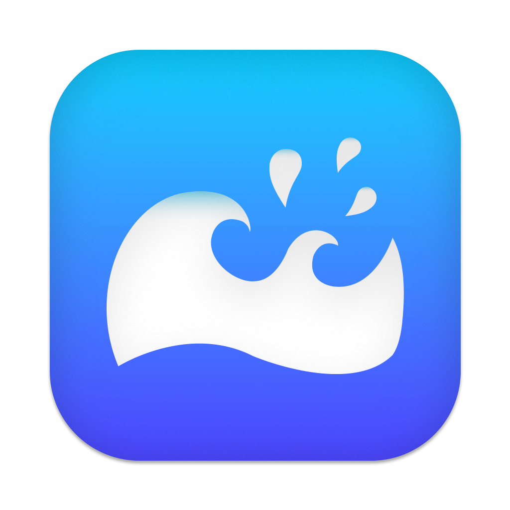

# LivePaper

	
	<h1>LivePaper</h1>
	

		<b>将任何网页变成 Mac 桌面壁纸</b>
	

## 软件介绍

LivePaper 是一款强大的 macOS 桌面壁纸增强工具，它可以将任何网页转换为动态桌面壁纸。无论是实时信息展示、精美图片轮播，还是互动性网页内容，LivePaper 都能完美呈现。

### 主要特色

1. **灵活的内容展示**
   - 支持任何网页作为壁纸源
   - 可以显示实时更新的信息（天气、日历、新闻等）
   - 支持本地 HTML 文件
   - 内置多个精选壁纸源

2. **智能的交互体验**
   - "浏览模式"支持直接与壁纸交互
   - 便捷的右键菜单操作
   - 支持网页缩放和位置调整
   - 可以随时切换不同壁纸

3. **强大的自定义功能**
   - 支持自定义 CSS 样式
   - 可注入自定义 JavaScript 脚本
   - 灵活的刷新间隔设置
   - 支持透明度调节

4. **系统友好设计**
   - 低资源占用
   - 电池模式自动禁用
   - 多显示器支持
   - 快捷键支持

### 内置壁纸源

1. **必应每日壁纸**
   - 每日更新的精美图片
   - 自动适应屏幕分辨率
   - 展示世界各地的自然与人文景观

2. **随机Google街景**
   - 探索世界各地街景
   - 自动随机切换位置
   - 沉浸式体验

3. **腾讯日历**
   - 优雅的日历界面
   - 显示农历和节假日
   - 适配暗色模式

### 使用场景

1. **信息展示**
   - 将天气预报设为壁纸
   - 显示实时股票行情
   - 展示待办事项清单

2. **视觉享受**
   - 精美图片轮播
   - 动态艺术作品展示
   - 实时景观直播

3. **工作效率**
   - 任务看板集成
   - 团队日历展示
   - 数据监控面板

## 功能特点

- 支持远程或本地网页作为壁纸
- 可与网页交互（"浏览模式"）
- 自定义时间间隔自动刷新网页
- 支持添加多个网页
- 可在不同显示器上显示
- 网页颜色反转（模拟深色模式）
- 自定义 CSS 和 JavaScript
- 调整透明度
- 支持透明背景
- 电池模式下自动禁用
- 自动静音
- 单张图片自动适应屏幕
- 可隐藏菜单栏图标
- 支持快捷键操作
- 支持多语言（中文、英文、日语、西班牙语等）

## 快速上手

1. **添加网页壁纸**
   - 点击菜单栏图标
   - 选择"添加网站"
   - 输入网址或选择本地文件

2. **调整显示效果**
   - 支持自定义 CSS 样式
   - 可调整透明度
   - 设置自动刷新间隔

3. **快捷操作**
   - 双击切换壁纸
   - 右键调出菜单
   - 快捷键控制

## 系统要求

- macOS 15.0 或更高版本
- Apple Silicon 或 Intel 处理器

## 致谢

本项目基于 [Plash](https://github.com/sindresorhus/Plash) 修改。

- 原作者：© Sindre Sorhus
- 修改者：© blank

## 反馈建议

如果您有任何问题或建议，欢迎提出 issue 或通过邮件联系我们。
